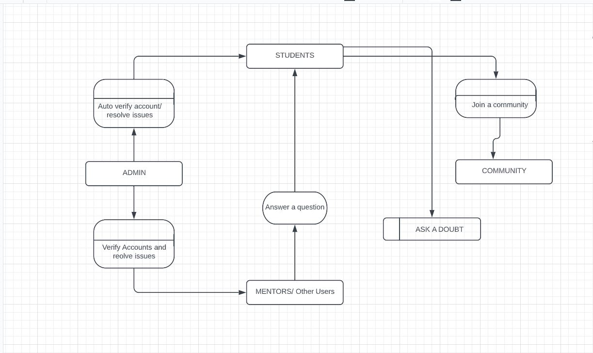

<h1 align="center">DATA FLOW DIAGRAM</h1>

 

### [Check it out](https://lucid.app/lucidchart/77201209-1e4c-4863-98eb-a0cc3a74266e/edit?beaconFlowId=A9EF326381CA52EF&invitationId=inv_2683803e-c0c0-4fae-b78c-ab278739dfc6&page=0_0#)

<h1 align="center">Landing Page UI</h1>

  

 

<h1 align="center">Profile section UI</h1>

  

 

<h1 align="center">Tutorials Page UI</h1>

  

 

<h1 align="center">Mentors page UI</h1>

  

 
